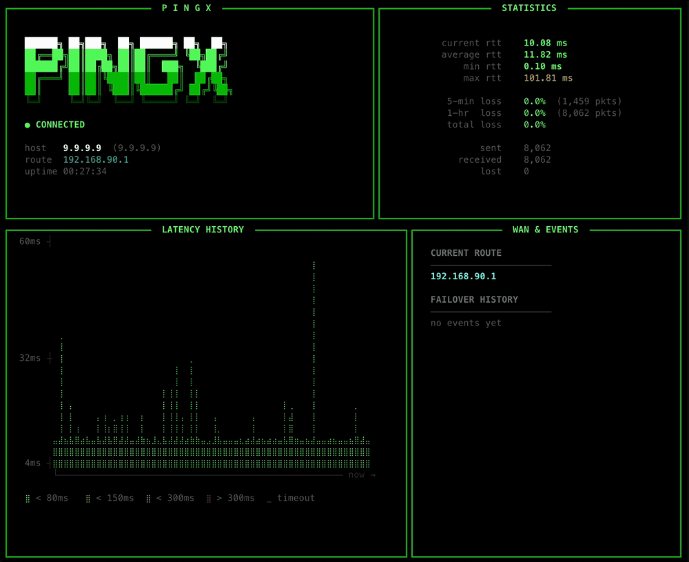

# pingx

A full-screen terminal ping monitor with auto-reconnect, WAN failover detection, and a retro TUI.

Standard `ping` stops the moment your network drops and forces you to rerun it. `pingx` keeps going — it detects the outage, retries in the background, and resumes automatically when connectivity returns. It also watches your default route for changes, which surfaces WAN failover events (e.g. fiber → Starlink) as they happen.



## Features

- **Auto-reconnect** — detects network down after 5 consecutive timeouts, retries in the background, resumes automatically on recovery
- **WAN failover detection** — polls the default route every 3 seconds; announces gateway changes as they happen
- **Braille sparkline** — rolling RTT history rendered with Unicode braille characters; auto-scales Y-axis to the observed range so variation is always visible
- **Live RTT stats** — current / average / min / max, updated every ping
- **Rolling loss windows** — packet loss over the last 5 minutes and last 1 hour, plus all-time total
- **Failover event log** — last 2 WAN events with timestamps and recovery durations
- **Colour themes** — 6 named palettes that restyle the entire interface
- **No root required** — uses unprivileged ICMP (`SOCK_DGRAM`) on macOS; see Linux notes below

## Requirements

- macOS or Linux (see [Platform support](#platform-support))
- Python 3.10+
- [rich](https://github.com/Textualize/rich)

## Installation

```bash
# From PyPI (once published)
pip install pingx

# From source
git clone https://github.com/Tom-xyz/pingx.git
cd pingx
pip install -e .
```

Or copy `pingx.py` anywhere on your `$PATH` and `chmod +x` it.

## Usage

```
pingx [OPTIONS] host
```

```bash
pingx 9.9.9.9
pingx google.com
pingx 192.168.1.1          # ping your router
pingx -c 100 8.8.8.8       # stop after 100 pings
pingx -i 1 -W 2 8.8.8.8   # 1-second interval, 2-second timeout
pingx --color blue 9.9.9.9 # blue theme
```

Press `Ctrl-C` to exit. A summary (packets transmitted/received, loss %, min/avg/max/stddev RTT) is printed on exit.

## Options

| Flag | Long | Default | Description |
|------|------|---------|-------------|
| `-c N` | `--count` | unlimited | Stop after N pings |
| `-i S` | `--interval` | `0.2` | Ping interval in seconds |
| `-s B` | `--size` | `56` | ICMP payload size in bytes |
| `-t N` | `--ttl` | `64` | IP Time To Live |
| `-W S` | `--timeout` | `1.5` | Receive timeout per ping |
| | `--color THEME` | `green` | Colour theme (see below) |
| | `--version` | | Print version and exit |

## Colour themes

`--color green` (default) `--color blue` `--color cyan` `--color amber` `--color red` `--color purple`

Each theme changes the entire interface palette — borders, logo gradient, sparkline health bands, stats colouring, and status indicators.

## Layout

```
┌────────────────────────────────┬───────────────────────────┐
│  PINGX logo + connection info  │  Live RTT & packet stats  │  (top, 2:5 ratio)
├────────────────────────────────┼───────────────────────────┤
│  Latency History               │  WAN & Events             │  (bottom, 3:2 ratio)
│  (braille sparkline, Y=RTT)    │  (route + failover log)   │
└────────────────────────────────┴───────────────────────────┘
```

The layout reflows on terminal resize. The latency history panel intentionally dominates — it's the primary visual.

## Sparkline

The latency history chart uses Unicode braille characters as a 2×4-pixel canvas per character, giving high-density RTT visualization without any dependencies beyond `rich`.

- Y-axis **auto-scales** to the observed RTT range — stable networks show their micro-variation instead of a flat line
- Right edge = newest ping (bold); scrolls left as data arrives
- Dim red `⣀` dots fill the chart before data arrives
- True timeouts render as natural gaps (empty braille space)
- Colour bands are intentionally wide (< 80ms = ok, not < 20ms) so normal home-network variation never flips colour

## Platform support

macOS works out of the box. `pingx` uses `socket.SOCK_DGRAM` with `IPPROTO_ICMP`, which macOS grants without elevated privileges.

**Linux** requires unprivileged ICMP to be enabled. If you see a permission error, run once as root:

```bash
sudo sysctl -w net.ipv4.ping_group_range="0 65535"
```

To make it permanent, add to `/etc/sysctl.conf`:

```
net.ipv4.ping_group_range = 0 65535
```

Or simply run `sudo pingx ...`.

**Windows** is not supported. Use WSL2.

## Running tests

```bash
pip install pytest
python3 -m pytest tests/
```

## License

MIT — see [LICENSE](LICENSE)
